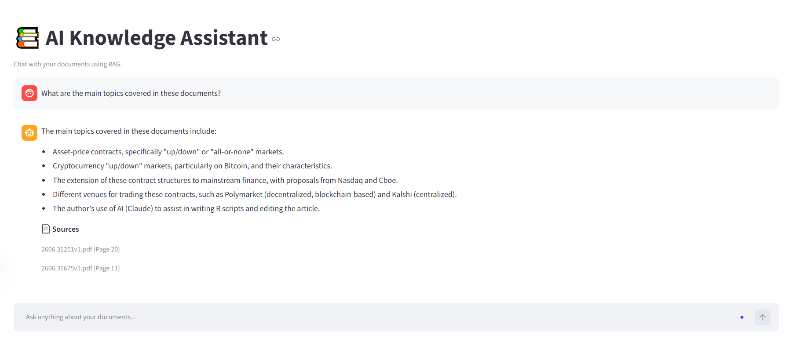
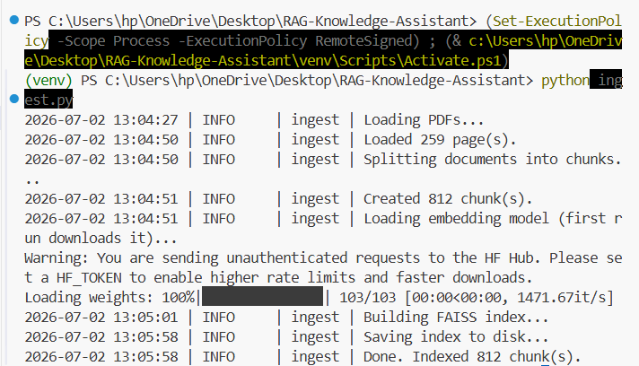
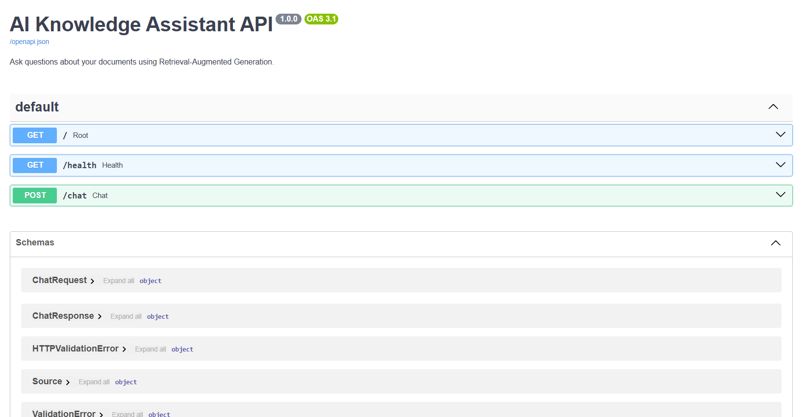
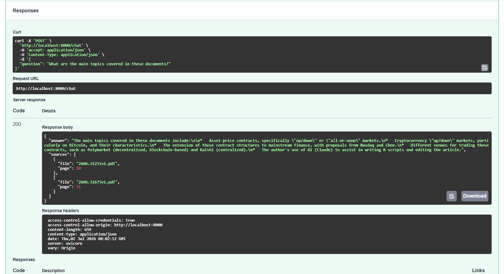

# AI Knowledge Assistant

A Retrieval-Augmented Generation (RAG) application for question answering over your
own PDF documents. Ask a question in plain English and receive an answer grounded in
the source material, with page-level citations.

**Live demo:** https://aahad699-lra.streamlit.app/

[](https://aahad699-lra.streamlit.app/)


<p align="center">
  
</p>

Built with LangChain, FAISS, local HuggingFace embeddings, and Google Gemini. It ships
with both a FastAPI JSON API and a Streamlit chat UI.

## Table of Contents

- [Overview](#overview)
- [Features](#features)
- [Architecture](#architecture)
- [Tech Stack](#tech-stack)
- [Project Structure](#project-structure)
- [Getting Started](#getting-started)
- [Running the Application](#running-the-application)
- [API Reference](#api-reference)
- [Configuration](#configuration)
- [Deployment](#deployment)
- [Troubleshooting](#troubleshooting)
- [Security](#security)
- [License](#license)

## Overview

The assistant indexes a collection of PDF documents into a local vector store, then
answers questions by retrieving the most relevant passages and passing them to a large
language model as context. Because the model is instructed to answer only from the
retrieved context, responses stay grounded in the source documents, and each answer
reports the file and page it came from. If the answer is not present in the documents,
the assistant says so rather than fabricating one.

## Features

- **Grounded answers** — responses are generated only from retrieved document context.
- **Source citations** — every answer includes the source file name and page number.
- **Two interfaces** — a FastAPI JSON API and a Streamlit chat UI, over the same pipeline.
- **Local embeddings** — text is embedded on-device with `sentence-transformers`, so there is no embedding API cost.
- **Efficient retrieval** — FAISS vector similarity search.
- **Deployment ready** — CORS, health checks, graceful startup and error handling, a Dockerfile, and blueprints for Streamlit Community Cloud and Render.

## Architecture

```
Ingestion (python ingest.py, one-time / on document change)

  PDFs in data/  ->  load  ->  split into chunks  ->  embed  ->  FAISS index (vectorstore/)

Query (API or UI)

  question  ->  retrieve top-k chunks  ->  prompt + context  ->  Gemini  ->  answer + sources
```

1. **Ingestion** — PDFs in `data/` are loaded, split into overlapping chunks, and
   embedded locally with `sentence-transformers/all-MiniLM-L6-v2`. The resulting vectors
   are stored in a local FAISS index under `vectorstore/`.
2. **Query** — the question is embedded, the most similar chunks are retrieved, and
   Gemini generates an answer using only that context.

## Tech Stack

| Layer          | Technology |
|----------------|------------|
| Orchestration  | LangChain 1.x (`langchain`, `langchain-classic`) |
| Embeddings     | `sentence-transformers/all-MiniLM-L6-v2` (HuggingFace) |
| Vector store   | FAISS (`faiss-cpu`) |
| Language model | Google Gemini (`gemini-2.5-flash`) via `langchain-google-genai` |
| API            | FastAPI and Uvicorn |
| UI             | Streamlit |
| PDF parsing    | `pypdf` |

## Project Structure

```
RAG-Knowledge-Assistant/
├── api.py               # FastAPI app (JSON API)
├── app.py               # Streamlit chat UI
├── ingest.py            # Build the FAISS index from data/*.pdf
├── config.py            # Central configuration (models, chunking, paths)
├── data/                # Source PDF documents
├── rag/                 # RAG building blocks
│   ├── loader.py        #   PDF loading
│   ├── splitter.py      #   Text chunking
│   ├── embeddings.py    #   HuggingFace embeddings
│   ├── vector_db.py     #   FAISS create / save / load
│   ├── retriever.py     #   Similarity retriever
│   ├── llm.py           #   Gemini model
│   ├── prompt.py        #   RAG prompt template
│   ├── chain.py         #   LangChain retrieval chain
│   └── pipeline.py      #   High-level RAGPipeline.ask()
├── utils/               # Logger, custom exceptions, helpers
├── tests/               # Manual smoke scripts (run individually)
├── Dockerfile           # Container image for the API
├── render.yaml          # Render deployment blueprint
├── requirements.txt
└── .env.example
```

## Getting Started

### Prerequisites

- Python 3.11 (recommended; 3.10 to 3.12 should also work)
- A Google Gemini API key: https://aistudio.google.com/app/apikey

### Local Setup

```bash
# 1. Create and activate a virtual environment
python -m venv .venv
# Windows (PowerShell):
.venv\Scripts\Activate.ps1
# macOS / Linux:
source .venv/bin/activate

# 2. Install dependencies
pip install -r requirements.txt

# 3. Configure the API key
cp .env.example .env          # Windows: copy .env.example .env
# then edit .env and set GOOGLE_API_KEY

# 4. Add PDF documents to data/ (sample papers are already included)

# 5. Build the vector index (downloads the embedding model on first run)
python ingest.py
```

The first `ingest.py` run downloads a roughly 90 MB embedding model, and the first
`pip install` pulls PyTorch. Both may take a few minutes.



## Running the Application

### FastAPI (JSON API)

```bash
python api.py
# or, with autoreload during development:
uvicorn api:app --reload
```

- Interactive documentation: http://localhost:8000/docs
- Health check: http://localhost:8000/health



Example request:

```bash
curl -X POST http://localhost:8000/chat \
  -H "Content-Type: application/json" \
  -d '{"question": "What are the main topics covered in these documents?"}'
```

Example response:

```json
{
  "answer": "A grounded answer generated from the retrieved context.",
  "sources": [
    { "file": "2508.15080v3.pdf", "page": 3 }
  ]
}
```



### Streamlit (chat UI)

```bash
streamlit run app.py
```

Opens a chat interface at http://localhost:8501.

## API Reference

| Method | Path      | Description |
|--------|-----------|-------------|
| GET    | `/`       | Basic service information |
| GET    | `/health` | Readiness probe; reports whether the index loaded |
| POST   | `/chat`   | Ask a question; returns an answer and sources |

Request body for `POST /chat`:

```json
{ "question": "string (required, non-empty)" }
```

Status codes:

| Code | Meaning |
|------|---------|
| 200  | Answer returned |
| 422  | Empty or invalid question |
| 503  | Index not built, or the pipeline is not ready |
| 500  | Unexpected error while generating the answer |

## Configuration

Application settings are defined in [`config.py`](config.py):

| Setting           | Default                                   | Purpose |
|-------------------|-------------------------------------------|---------|
| `EMBEDDING_MODEL` | `sentence-transformers/all-MiniLM-L6-v2`  | Local embedding model |
| `LLM_MODEL`       | `gemini-2.5-flash`                        | Gemini model |
| `CHUNK_SIZE`      | `1000`                                    | Characters per chunk |
| `CHUNK_OVERLAP`   | `200`                                     | Overlap between chunks |
| `TOP_K`           | `3`                                       | Chunks retrieved per query |
| `DATA_DIR`        | `data`                                    | PDF source folder |
| `VECTOR_DB_DIR`   | `vectorstore`                             | FAISS index location |

Environment variables:

| Variable         | Required | Default | Purpose |
|------------------|----------|---------|---------|
| `GOOGLE_API_KEY` | Yes      | —       | Gemini API key |
| `LOG_LEVEL`      | No       | `INFO`  | Logging verbosity |
| `PORT`           | No       | `8000`  | API port (set automatically by most hosts) |

## Deployment

### Streamlit Community Cloud

The live demo is deployed here. To deploy your own copy:

1. Push the repository to GitHub.
2. On [share.streamlit.io](https://share.streamlit.io), create a new app pointing at
   `app.py` in your repository and branch.
3. In the app settings, open **Secrets** and add your key:
   ```toml
   GOOGLE_API_KEY = "your-key"
   ```
4. Deploy. The FAISS index is not committed to the repository, so on the first load the
   app builds it from the PDFs in `data/`. This takes about a minute; subsequent loads
   are immediate.

The free tier provides approximately 1 GB of memory, which is sufficient for the default
embedding model.

### Render (Docker, API)

The repository includes a [`render.yaml`](render.yaml) blueprint. Docker is built in the
cloud, so a local Docker installation is not required.

1. Push the repository to GitHub.
2. In the [Render dashboard](https://dashboard.render.com), choose **New** and then
   **Blueprint**, and select the repository. Render reads `render.yaml`.
3. Set the `GOOGLE_API_KEY` environment variable in the service settings. It is marked
   `sync: false` and is never stored in the repository.
4. Render builds the Docker image and deploys. The service is healthy once `/health`
   returns `{"ready": true}`.

The free plan spins down when idle; the first request after a cold start can take 30 to
60 seconds.

### Docker (local)

Requires Docker installed locally. The image builds the FAISS index at build time
(embeddings run locally, so no API key is needed during the build) and serves the API.

```bash
docker build -t rag-assistant .
docker run -p 8000:8000 -e GOOGLE_API_KEY=your-key rag-assistant
```

Then open http://localhost:8000/docs. To re-index, add or replace files in `data/` and
rebuild the image.

## Troubleshooting

| Symptom | Resolution |
|---------|------------|
| `VectorStoreNotFoundError`, or `/health` shows `"ready": false` | Run `python ingest.py` to build the index. |
| `No PDF files found in 'data'` | Add at least one PDF to `data/`. |
| `Missing required environment variable: GOOGLE_API_KEY` | Create `.env` from `.env.example` and set the key. |
| `/chat` returns 503 | The index is not built or the key is missing; check `/health`. |
| Answer is "I couldn't find that information..." | The information is not in the documents, or increase `TOP_K`. |
| `ModuleNotFoundError: No module named 'langchain.chains'` | Ensure `langchain-classic` is installed; it is listed in `requirements.txt`. |

## Security

- Never commit `.env`. It is listed in `.gitignore` and `.dockerignore`, and the Docker
  image receives the key at runtime, so the secret is never baked into the image.
- Rotate any API key that has been committed or shared, at
  https://aistudio.google.com/app/apikey.
- The API enables permissive CORS for convenience. Restrict the allowed origins before
  exposing the service publicly.

## License

Provided for personal and educational use.
